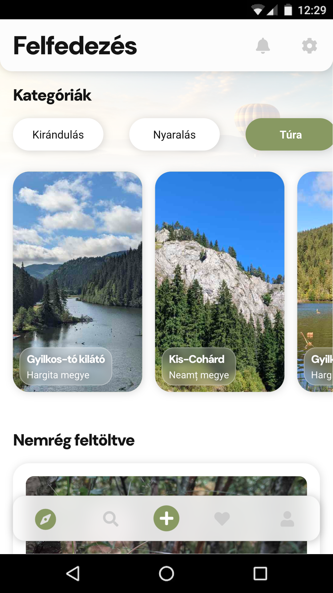
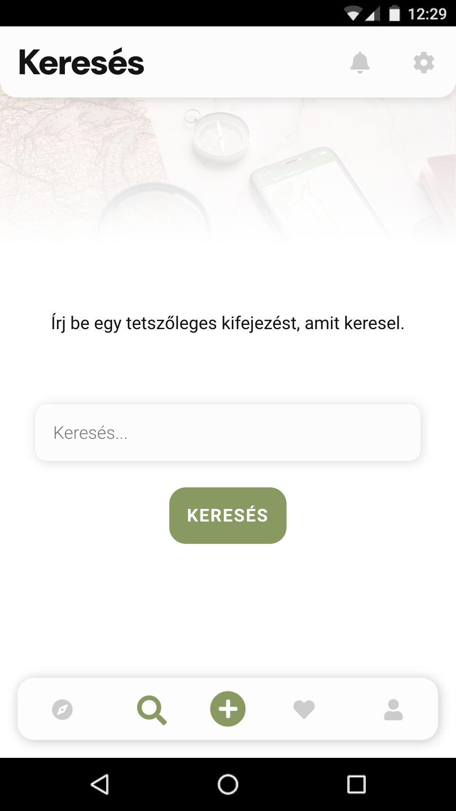
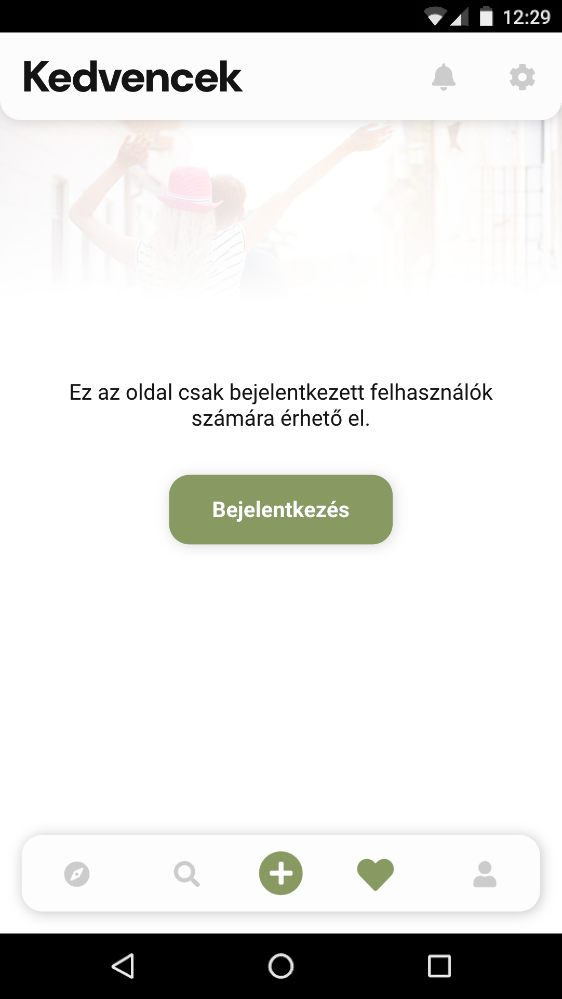
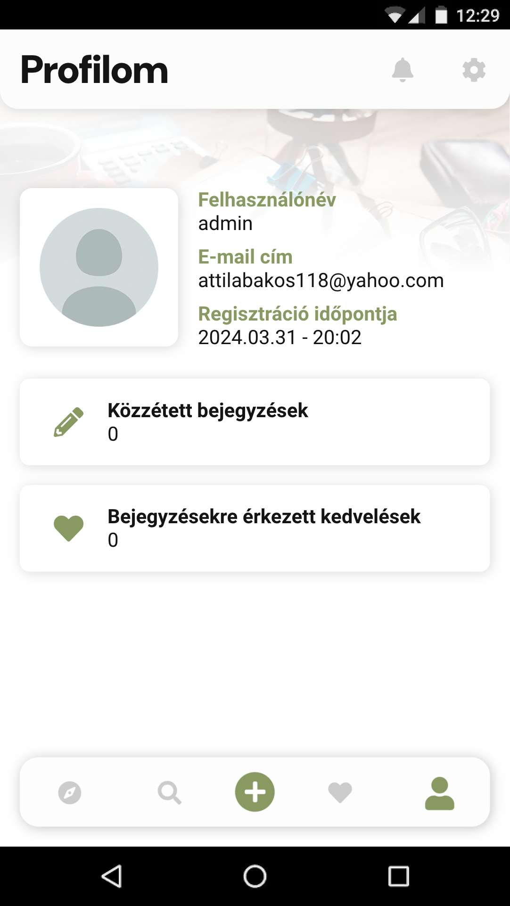

# Yourney (app)

## Leírás

A **Yourney** egy programtervező alkalmazás, ami azzal a céllal készült, hogy a felhasználók ötleteket gyűjthessenek és inspirálódjanak más felhasználók feltöltött programterveiből.

## Képernyőképek

